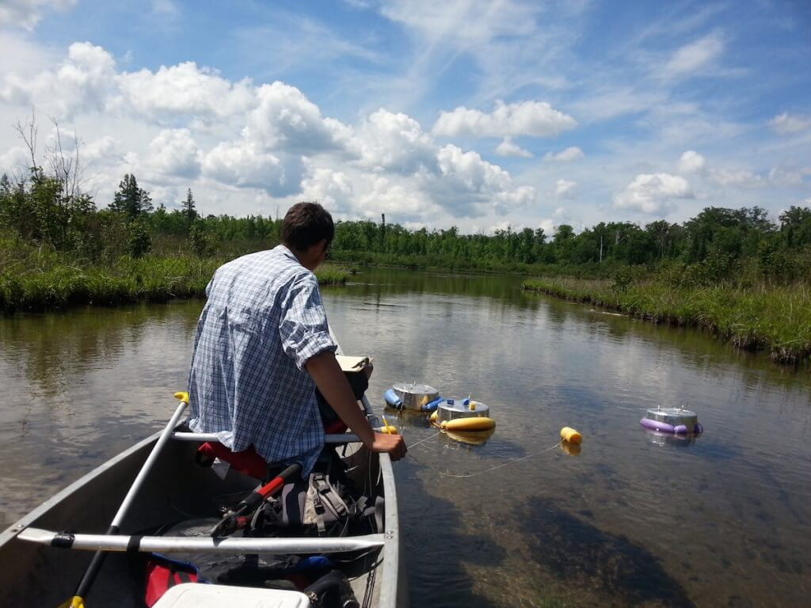
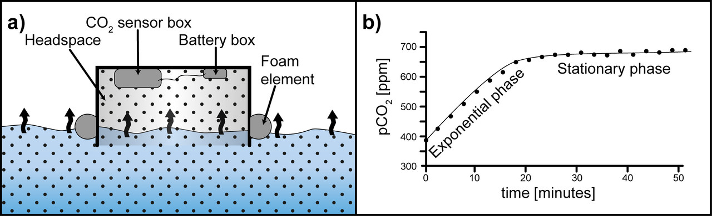

```{r setup, include=FALSE}
knitr::opts_chunk$set(echo = TRUE)
#install.packages('stream')
library(here)
library(tidyverse)
library(dataRetrieval)
library(lubridate)
library(trend)
```

# Aquatic Gases

Gases are the inputs and outputs of many important processes in riverine systems. 
However, their ephemeral nature makes directly measuring them difficult, if not 
impossible. 

The most commonly discussed forms of gases take in aquatic systems is 'dissolved'. A dissolved gas is entirely intermixed within solution. Gases can also exist in solution as bubbles. The shortest lived of these are the conventional, large bubbles you think of when blowing out underwater. However, gases can also exist as microbubbles
on the surfaces of suspended sediments and colloids. 



## Oxygen

The aquatic gas with the most historical interest, oxygen represents a key indicator of aquatic health. Loading in some data from the South Platte via the USGS, we can see that it cycles with season and time of day. 
```{r}
readNWISdv(siteNumbers = '06711565',
            parameterCd = c('00010','00300'),
            startDate = '2019-10-01',
            endDate =  '2020-09-30') %>%
  rename('DO (mg/L)' = X_00300_00003,
         'Temp (C)' = X_00010_00003) %>%
  select(Date, `DO (mg/L)`, `Temp (C)` ) %>%
  pivot_longer(cols = -Date, names_to = 'var', values_to = 'val') %>%
  ggplot(., aes(x = Date, y = val))+
    geom_line()+
    facet_wrap(~var, ncol = 1, scales = 'free')+
    labs(y = '', title = '06711565')
      
```

## Greenhouse gases


# What the flux?

Gases are always moving, flowing from high areas of high concentrations to lower
concentrations. We describe the net movement of something out of a system as 
'flux'. Remember from our intro unit that you can draw the bounds of a system 
anywhere. We could calculate flux of anything out (or in) of anything! Flux of 
calcium out of a watershed (called 'solute export'), the flux of students out of
a classroom, or the flux of gas from the surface of a river.

## How to estimate gas flux

Flux = *k*(Concentration_sys - Concentration_out)

The lecture videos cover this, but as a reminder: there are three things we need to know to estimate gas flux.

* The concentration of the gas outside the system
* The concentration of the gas inside the system
* The speed at which the gas can move in and out of the system

The first two are pretty straightforward. We can use any number of methods to measure gas concentrations. Depending on the gas, sometimes samples are taken in air-tight bottles, preserved, and returned to a lab to be analysed. Other gases (like carbon dioxide and methane) preferentially absorb certain wavelengths of light. For those gases, we can use portable analyzers to measure concentrations at high frequency. We will be using data from a Los Gatos Ultra-Portable Greenhouse Gas Analyzer (UGGA) in this homework.

You can watch an over-hyped promotional video for the [UGAA here.](https://www.youtube.com/watch?v=p3qiYVErCc8&ab_channel=ABBMeasurementExpert)

## Estimating *k*

Once we know the gradient of the gas between the water and the air, we need to
tackle that third item on our list. The speed at which gases can move in or out
of water is called the 'gas transfer velocity' or *k*. It is largely a function of how 'open', 'rough', and 'turbulent' the water surface is. I use quotes on those because research shows that *k* is way more complicated than any (or all) of those things. What we do know is that *k* varies widely across  and within aquatic systems. 

The problem in measuring *k* is a classic one in science: measuring water disturbs water. To overcome this, researchers leverage the fact that net flux can be measured directly, and be used to solve for *k*. 

*k* = (Concentration_system - Concentration_surroundings)/Flux

## Chamber measurements

One way researchers measure flux is with the appropriately named 'flux chambers'. These were originally developed for soil science, but have recently been applied to water as well. The idea is you constantly sample air from a chamber that is sitting just on top of the water surface, you can observed the change in concentration as an estimate of *k*. Below is a conceptual diagram of how this works. In this homework, we will be working with a chamber that took replicate measurements. 



This diagram is from [Eurorun](https://freshproject-eurorun.jimdofree.com/eurorun/project-eurorun/methods/), a large gas flux project. Before you put the chamber down on the water, the gas inside will have the same concentration as the atmosphere (see the graph starting at about 400 ppm CO2). When you put the chamber down on the water it forms a seal and the gradient begins to equillibrate. The slope of the line in the 'exponential phase' is *k*. As gas fluxes in or out of the water, it will eventually approach equilibrium with the surface water. This is the 'stationary phase' and can be used as an estimate for the concentration of the gas in the surface of the water. In this assignment, we won't be using the stationary phase and instead an measurement will be provided to you.

## Sources and sinks

Like I mentioned in my flux introduction, fluxes can be across anything and in any direction. One way we can talk about flux is if something is a 'source' or a 'sink' of what we are interested in. Sources will have a positive gradient and sinks will have a negative gradient. We only need *k* to tell us the magnitude of the effect!

The role of freshwaters as sources and sinks of gas is still poorly understood. If this interests you I highly recommend looking at the work of [Professor Bob Hall](https://scholar.google.com/citations?user=UDfwrOkAAAAJ&hl=en). 

# Assignment 

In this assignment, we are going to look at chamber data from the Yahara River in Madison, WI, see if it is a source or sink of methane in the landscape, and make a flux estimate.

## Q0:

Just like last time, let's make sure R knows where we are working. Call 'here()' to check.

```{r}
here()
```

## Q1

Now let's read in our data. This data file is from a greenhouse gas analyzer and has multiple measurements in it at a single site on the Yahara. The file starts with the chamber hanging in the air.

### Part A

Read in the 'gga_03Jun2014_f0000.txt' file from the 'data' folder. Reduce your data to only chamber methane concentrations and datetime. Do not edit your original data file.

```{r}
gas <- read.csv('data/gga_03Jun2014_f0000.txt', skip = 1) %>%
  filter(!is.na(X.CH4._ppm)) %>%
  mutate(Time = mdy_hms(Time)) %>%
  select(time = Time, methane_ppm = X.CH4._ppm)
```

### Part B

Plot your data as a time series with appropriate labels. 

```{r}
ggplot(gas, aes(x = time, y = methane_ppm))+
  geom_point()+
  labs(x = 'Time', y = 'CH4 (ppm)')
```

### Part C

How many estimates of *k* can we make with our data? In other words, how many
times did the technician raise and lower the chamber?

## Q2

Let's try to estimate *k* on our own for the Yahara.

### Part A

To estimate *k* we will fit linear models to the curve right after the chamber
has been set on the water surface and the methane is diffusing at a steady rate.

The first step in doing so is excluding data from when the chamber is hanging in
the air. This is also useful as a local, atmospheric methane measurement.

Calculate a reasonable 'baseline' methane concentration for your data.

```{r}
atmo <- quantile(gas$methane_ppm, .15)
atmo
# or
min(gas$methane_ppm)
```

### Part B
To estimate *k* we need to extract the sharp rises from the data, as this is
when the chamber is still reaching equilibrium. After a a certain point, the air
in the chamber will begin to saturate. This will appear in the time series as 
fluctuations in methane concentrations. We will also want to filter data while
the chamber is in the air. 

Filter your data to only the sharp rises, before the chamber begins to saturate,
and after it has been placed on the water surface. (Hint: this can either be
done through times, values, and/or a new index.)

```{r}
rises <- gas %>%
  mutate(diff = methane_ppm-lag(methane_ppm)) %>%
  filter(diff > 0,
         methane_ppm > 2.5,
         methane_ppm < 10)
```

### Part C

Plot your new, filtered dataset. Don't worry about making your plot too pretty,
just basic labels is fine.

```{r}
ggplot(rises, aes(x = time, y = methane_ppm))+
  geom_point()+
  labs(x = 'Time', y = 'CH4 (ppm)')
```

### Part D

Find the slope of each segment using a Sen's slope test. (Hint: look at the Acid
Rain homework for an example of this.)

```{r}
rises <- rises %>%
  mutate(flag = if_else(time < as.POSIXct('2014-06-03 11:15', tz = 'UTC'), 1,
                        if_else(time > as.POSIXct('2014-06-03 11:25', tz = 'UTC'), 3, 2)))

m1 <- rises %>%
  filter(flag == 1) %>%
  na.omit() 

m2 <- rises %>%
  filter(flag == 2)

m3 <- rises %>%
  filter(flag == 3)

s1 <- sens.slope(m1$methane_ppm)
s2 <- sens.slope(m2$methane_ppm)
s3 <- sens.slope(m3$methane_ppm)
s1
s2
s3
```

## Part E

Report the mean of your *k* estimates.

```{r}
mean_k <- mean(s1$estimates[[1]], s2$estimates[[1]], s3$estimates[[1]])
mean_k
```

## Q3

### Part A

You run a water sample from the surface of the Yahara alongside your chamber
measurement and find the methane concentration in the water to be 200 ppm. The 
chamber is 0.5m tall.Calculate methane flux for your site, report your answer in kg of methane per hour per square meter of water surface.

```{r}
gradient <- (200-atmo[[1]])

# calc flux in ppm/s
flux = mean_k*(gradient)

# convert to kg/hour*m2
flux*(3600/1)*(1/1000)*(0.5)*(0.001) # sec to hour, mg to kg, height of chamber, liter to cubic 
```

## Part B

Does our flux show the Yahara River acting as a source or sink of methane?

## Part C

Imagine you are tasked with scaling up your estimate of methane flux for the Yahara
site from an hour to an entire water year. Assume you only have the funding to make
3 more trips for measurements. When would you take them? What other public data would 
you be interested seeing to inform your attempt?

## Part D

Imagine you are tasked with scaling up your estimate of methane hourly methane 
flux of the entire Yahara. Assume you only have the funding to make 3 more trips for measurements. Where would you take them? What other public data would you be interested seeing to inform your attempt?


